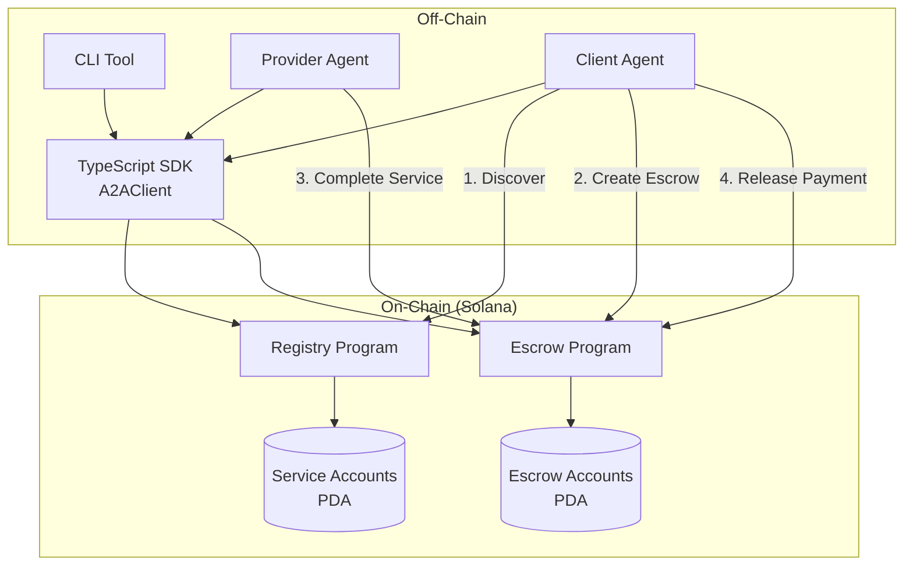
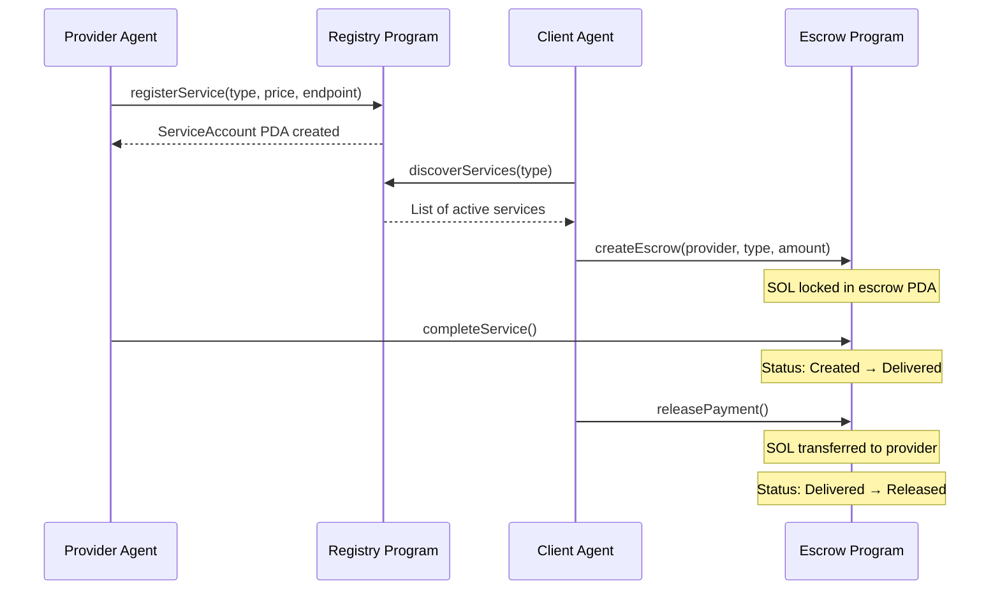

# A2A Pay - Architecture

## System Design

## Payment Flow

## Program Architecture

### Registry Program
- **PDA Seeds:** `["service", owner_pubkey, service_type]`
- **Instructions:** `register_service`, `update_service`, `deactivate_service`
- **State:** `ServiceAccount { owner, service_type, price, endpoint, is_active, created_at, reputation }`

### Escrow Program
- **PDA Seeds:** `["escrow", client_pubkey, provider_pubkey, service_type]`
- **Instructions:** `create_escrow`, `complete_service`, `release_payment`, `dispute`
- **State:** `EscrowAccount { client, provider, amount, status, service_type, created_at }`
- **Status Flow:** `Created → Delivered → Released` (or `→ Disputed` with refund)

## Security Model

| Concern | Solution |
|---------|----------|
| Fund safety | SOL held in PDA, not by either party |
| Authorization | Signer checks + `has_one` constraints |
| Double-spend | PDA uniqueness per (client, provider, service_type) |
| Disputes | Client can dispute and reclaim funds before release |

## Tech Stack

| Layer | Technology |
|-------|-----------|
| Smart Contracts | Anchor 0.32.1 (Rust) |
| Blockchain | Solana (Devnet) |
| SDK | TypeScript + @coral-xyz/anchor |
| CLI | ts-node + @a2a-pay/sdk |
